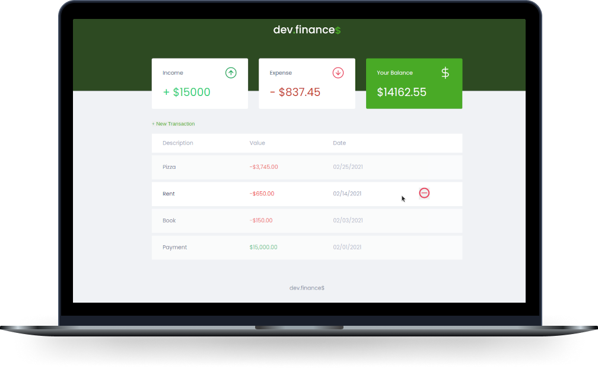

<h1 align="center">
  
</h1>

 

  

---

 

  
  
  
  
  
  
  

  <a href="#-project">Project</a> |
  <a href="#-technologies">Technologies</a> |
  <a href="#-license">License</a> |
  <a href="#-credits">Credits</a>

 

---

## 🚀 Technologies

---

## 💻 Project

This application was built in the Rocketseat event, and this project consists in managing your finances. I worked with Javascript, HTML and CSS,
but I wanted to take it to the a next level, so I used this project to apply my knowledge in ReactJS!

---

## :memo: License

This project is under MIT license. See the [LICENSE](https://github.com/yuukiasuna00/devfinance/blob/main/LICENSE) file for more details.

---

### 💜 Credits

Made with ❤️ by me and [Rocketseat](https://github.com/Rocketseat) 💜
